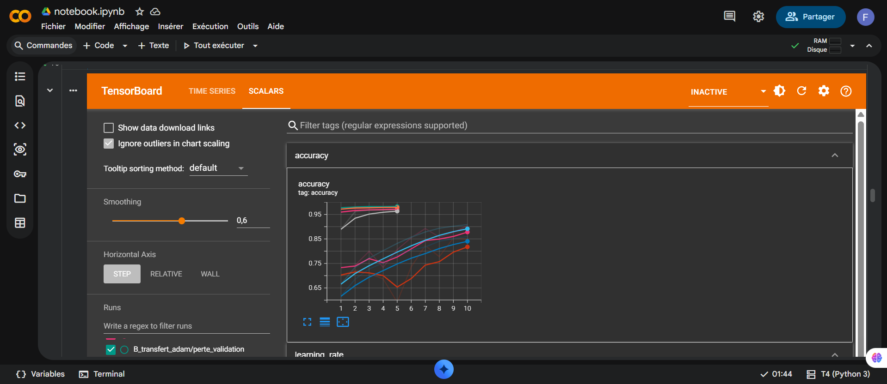
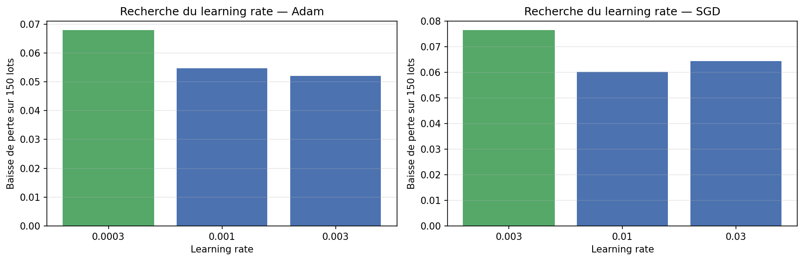
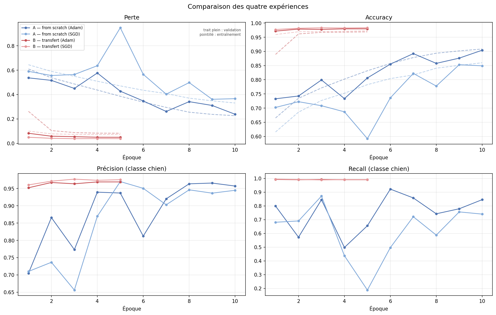
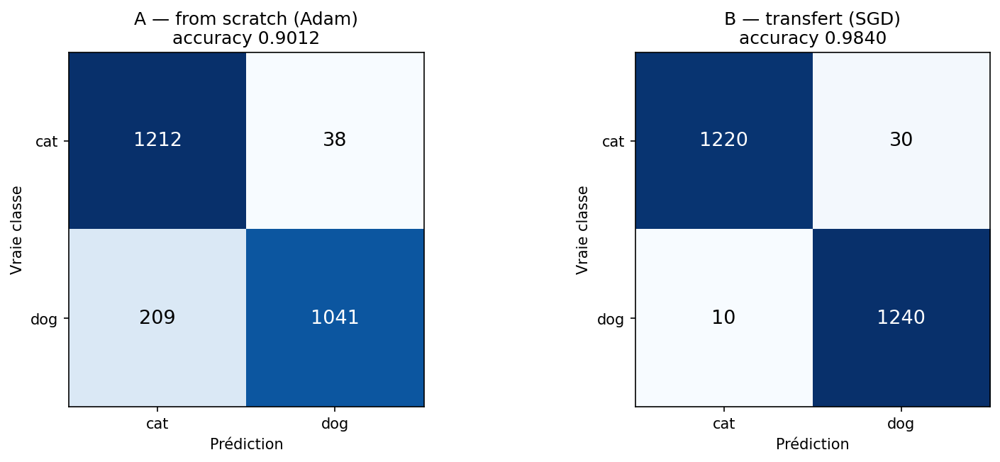
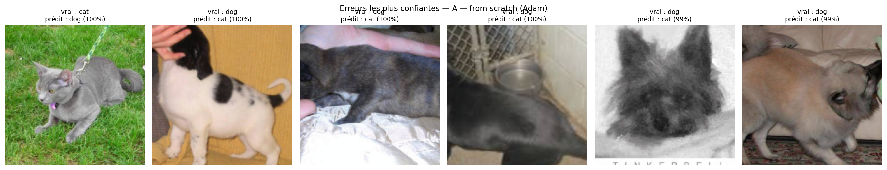
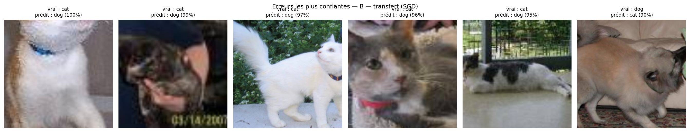

# CNN *from scratch* vs Transfert d'apprentissage — Cats vs Dogs

Devoir de Deep Learning — **Fodé Mamoudou Camara** — Master 1 Intelligence Artificielle, Dakar Institute of Technology — septembre 2026

---

## Objectif

Comparer deux approches de classification d'images binaire (chat / chien) sur le
même jeu de données :

- **Expérience A** — un réseau convolutif construit et entraîné entièrement
  *from scratch*, à partir de poids aléatoires ;
- **Expérience B** — un **transfert d'apprentissage** à partir d'un ResNet18
  pré-entraîné sur ImageNet, dont seule la tête de classification est réentraînée.

L'étude mesure l'impact du transfert sur la **vitesse de convergence**, la
**performance finale**, la **robustesse** face au surapprentissage et le **coût
de calcul**.

**Bonus couverts.** Split train/validation justifié (organisation des données,
plus bas), augmentation de données raisonnable (transformations), scheduler de
learning rate (`CosineAnnealingLR`), matrice de confusion et erreurs typiques
commentées (résultats), journalisation TensorBoard des métriques (section
suivante).

---

## Environnement

Le projet a été développé et exécuté sur **Google Colab**, avec accélération GPU.

| Élément | Valeur |
|---|---|
| Matériel | NVIDIA Tesla T4, 15,6 Go |
| Python | Python 3 (runtime Colab standard) |
| PyTorch | 2.11.0 (CUDA 12.8) |
| Graine aléatoire | 42 |

### Installation

```bash
pip install -r requirements.txt
```

Sur Colab, ces dépendances sont déjà présentes. La disponibilité du GPU est
vérifiée en section 1 du notebook ; l'entraînement sur processeur seul serait
beaucoup plus lent.

---

## Organisation des données

Le jeu de données **n'est pas versionné** dans ce dépôt (25 000 images, environ
550 Mo). Il doit être téléchargé séparément.

**Téléchargement :**
<https://s3.amazonaws.com/content.udacity-data.com/nd089/Cat_Dog_data.zip>
(source d'origine : [Dogs vs Cats, Kaggle](https://www.kaggle.com/c/dogs-vs-cats))

**Arborescence attendue après décompression :**

```
Cat_Dog_data/
├─ train/
│  ├─ cat/    (11 250 images)
│  └─ dog/    (11 250 images)
└─ test/
   ├─ cat/    (1 250 images)
   └─ dog/    (1 250 images)
```

**Placement.** Déposer l'archive `Cat_Dog_data.zip` dans un dossier Google Drive,
puis indiquer ce dossier dans la variable `BASE` (section 1 du notebook). Le
notebook copie l'archive vers le disque local de la machine Colab avant de la
décompresser.

> Ce détour par `/content/` est volontaire : lire 25 000 petits fichiers
> directement depuis Google Drive fait transiter chaque image par le réseau et
> ralentit fortement l'entraînement.

**Découpage.** Le dossier `train/` est réparti en 80 % d'entraînement
(18 000 images) et 20 % de validation (4 500 images), avec une graine fixée. Le
dossier `test/` (2 500 images) n'est utilisé qu'à l'évaluation finale (section 9)
et n'a servi à aucun choix d'hyperparamètre.

---

## Exécution

Le projet tient dans un notebook unique, `notebook.ipynb`, dont les cellules
s'exécutent dans l'ordre :

| Section | Contenu | GPU |
|---|---|---|
| 1–2 | Environnement, données, DataLoaders | non |
| 3–4 | Définition du CNN, fonctions d'évaluation et d'entraînement | non |
| 5 | Recherche du learning rate | oui |
| 6 | Entraînements de l'expérience A (Adam puis SGD) | oui |
| 7 | Construction du modèle B et entraînements | oui |
| 8 | Courbes comparatives et tableau récapitulatif | non |
| 9–10 | Test final, matrices de confusion, analyse des erreurs | oui |

Les sections 5, 6 et 7 doivent être exécutées dans cet ordre : les learning rates
retenus en section 5 sont réutilisés par les deux expériences. Les durées
d'entraînement sont mesurées par le notebook et reportées dans les résultats
ci-dessous.

### Suivi en direct avec TensorBoard

Chaque appel à `entrainer` écrit ses métriques (perte, accuracy, précision,
recall, learning rate) dans un journal TensorBoard sous `<BASE>/runs/<nom>/`, en
complément du carnet de bord JSON utilisé pour les figures. Avant de lancer les
entraînements (sections 6 et 7), une cellule du notebook affiche le tableau de
bord directement dans Colab :

```python
%load_ext tensorboard
%tensorboard --logdir "{BASE}/runs"
```

Les courbes se mettent à jour au fil des époques, sans attendre la fin de
l'entraînement. Le dossier `runs/` n'est pas versionné (voir `.gitignore`) : il
se régénère à chaque exécution et n'a pas sa place dans un dépôt Git.

Le tableau de bord n'étant pas visible hors de Colab, en voici une capture après
les quatre entraînements :



### Entraîner

Les entraînements sont lancés par la fonction `entrainer` (définie en section 4),
dans les sections 6 et 7 du notebook.

**Expérience A — CNN from scratch**

```python
hist_a_adam = entrainer(
    SimpleCNN(), nom="A_scratch_adam",
    trainloader=trainloader, valloader=valloader,
    epochs=10, optim_name="adam", lr=lr_adam,
    weight_decay=1e-4, scheduler_name="cosine",
)
```

**Expérience B — Transfert d'apprentissage**

```python
hist_b_adam = entrainer(
    construire_resnet18(), nom="B_transfert_adam",
    trainloader=trainloader, valloader=valloader,
    epochs=5, optim_name="adam", lr=lr_adam,
    weight_decay=1e-4, scheduler_name="cosine",
)
```

Les variantes SGD s'obtiennent avec `optim_name="sgd"` et `lr=lr_sgd`.

**Hyperparamètres**

| Paramètre | Expérience A | Expérience B |
|---|---|---|
| Architecture | 4 blocs [Conv-BN-ReLU] × 2 + MaxPool, puis Global Average Pooling | ResNet18 pré-entraîné (ImageNet) |
| Taille d'entrée | 224 × 224 | 224 × 224 |
| Taille de lot | 64 | 64 |
| Époques | 10 | 5 |
| Optimiseurs comparés | Adam, SGD (momentum 0,9, Nesterov) | Adam, SGD (momentum 0,9, Nesterov) |
| Learning rate | issu de la recherche (section 5) | identique à l'expérience A |
| Scheduler | `CosineAnnealingLR` | `CosineAnnealingLR` |
| Dropout | 0,5 (tête) | 0,4 (tête) |
| BatchNorm | après chaque convolution | héritée du ResNet, gelée |
| Weight decay | 1e-4 | 1e-4 |
| Paramètres entraînables | 1 206 370 | 1 026 (sur ~11,2 M) |

**Base du transfert.** ResNet18 avec les poids `IMAGENET1K_V1`. Stratégie retenue :
**extraction de caractéristiques**. L'ensemble du backbone est gelé et la couche
`fc` est remplacée par une tête Dropout 0,4 → Linear(512, 2), seule
partie réentraînée. Le fine-tuning du dernier bloc est disponible via
`construire_resnet18(fine_tune=True)` mais n'a pas été retenu : le domaine des
chats et des chiens est déjà largement couvert par ImageNet.

**BatchNorm gelées.** Geler les poids (`requires_grad=False`) n'empêche pas les
couches BatchNorm de mettre à jour leurs statistiques courantes (moyenne et
variance) lorsque le modèle est en mode `train()`. Sans précaution, le backbone
censé être figé dériverait vers les statistiques de notre jeu de données. La
fonction `figer_batchnorm` repasse ces couches en mode `eval()` à chaque époque de
l'expérience B.

### Évaluer et recharger un modèle

Les modèles ne sont pas évalués depuis la mémoire mais **rechargés depuis leur
fichier de checkpoint**, ce qui vérifie que la sauvegarde est exploitable
indépendamment de la session :

```python
model, checkpoint = recharger_modele("B_transfert_adam", construire_resnet18)
resultats = evaluer(model, testloader, nn.CrossEntropyLoss())
```

**Emplacement des checkpoints** (hors dépôt Git, voir `.gitignore`) :

```
<BASE>/checkpoints/
├─ A_scratch_adam.pt
├─ A_scratch_sgd.pt
├─ B_transfert_adam.pt
└─ B_transfert_sgd.pt
```

Chaque checkpoint contient les poids du modèle, l'époque de sauvegarde,
l'accuracy de validation atteinte, les noms de classes et la configuration
d'entraînement. Le critère de sauvegarde est l'**accuracy de validation**, jamais
celle d'entraînement.

---

## Régularisation et stabilisation de l'apprentissage

**Batch Normalization** — après chaque convolution, avant la ReLU. Pendant
l'entraînement, tous les poids évoluent simultanément : la distribution des
valeurs reçues par chaque couche se déplace en permanence. La BatchNorm recentre
et remet à l'échelle les activations de chaque canal sur le lot courant, ce qui
stabilise l'apprentissage et accélère la convergence. Le biais des convolutions
est désactivé (`bias=False`) car la BatchNorm possède déjà son propre terme de
décalage.

**Global Average Pooling** — en sortie des blocs convolutifs, chacune des 256
cartes de 14 × 14 est résumée par sa moyenne. Un aplatissement direct aurait produit
50 176 entrées pour la première couche dense ; avec le GAP, la tête ne compte
qu'environ 33 000 paramètres, ce qui limite fortement le risque de mémorisation.

**Dropout** — uniquement dans la tête de classification (0,5 en A, 0,4 en B).
Il éteint aléatoirement une fraction des activations à chaque passage, empêchant
le réseau de s'appuyer sur quelques neurones. Il n'est pas appliqué aux blocs
convolutifs : les activations voisines d'une carte de caractéristiques sont
fortement corrélées, si bien qu'y éteindre des valeurs isolées régularise peu, et
la BatchNorm y joue déjà un rôle stabilisateur.

**Augmentation de données et weight decay** — recadrage aléatoire, symétrie
horizontale, rotation ±15°, variation de luminosité, contraste et saturation,
appliqués uniquement à l'entraînement. Validation et test subissent un
redimensionnement et un recadrage central déterministes. Le weight decay (1e-4)
pénalise les poids de forte amplitude.

---

## Résultats

### Recherche du learning rate



Trois valeurs sont testées par optimiseur, sur le CNN de l'expérience A, lors
d'entraînements courts de 150 lots partant de la même initialisation. Le critère retenu est la **baisse** de
la perte (moyenne des 20 premiers lots moins moyenne des 20 derniers) plutôt que
sa valeur finale, afin de mesurer la vitesse d'apprentissage.

| Optimiseur | Valeurs testées | Retenue |
|---|---|---|
| Adam | 3e-4 / 1e-3 / 3e-3 | **3e-4** |
| SGD | 3e-3 / 1e-2 / 3e-2 | **3e-3** |

Les plages diffèrent volontairement : Adam adapte lui-même la taille du pas pour
chaque poids, tandis que SGD applique le learning rate tel quel et requiert des
valeurs environ dix fois plus élevées.

### Courbes d'apprentissage



*(trait plein : validation — pointillé : entraînement)*

### Synthèse de l'entraînement

Meilleure époque de chaque expérience (celle du checkpoint sauvegardé), sur le jeu
de validation.

| Expérience | Meilleure époque | Val accuracy | Précision | Recall | Durée d'entraînement |
|---|---|---|---|---|---|
| A — from scratch (Adam) | 10 / 10 | 0,9042 | 0,9571 | 0,8457 | 25 min 29 s |
| A — from scratch (SGD) | 9 / 10 | 0,8531 | 0,9365 | 0,7566 | 25 min 51 s |
| B — transfert (Adam) | 4 / 5 | 0,9796 | 0,9690 | 0,9906 | 10 min 19 s |
| B — transfert (SGD) | 5 / 5 | **0,9833** | 0,9754 | 0,9915 | 10 min 20 s |

### Performances sur le jeu de test

Métriques calculées sur les 2 500 images du dossier `test/`. Classe positive :
**chien** (`cat = 0`, `dog = 1`).

| Expérience | Loss | Accuracy | Précision | Recall | F1 |
|---|---|---|---|---|---|
| A — from scratch (Adam) | 0,2497 | 0,9012 | 0,9648 | 0,8328 | 0,8939 |
| A — from scratch (SGD) | 0,3821 | 0,8336 | 0,9299 | 0,7216 | 0,8126 |
| B — transfert (Adam) | 0,0516 | 0,9828 | 0,9733 | 0,9928 | 0,9830 |
| B — transfert (SGD) | **0,0429** | **0,9840** | **0,9764** | 0,9920 | **0,9841** |

### Matrices de confusion



Meilleur modèle de chaque expérience sur le jeu de test :

| | Chats pris pour des chiens | Chiens pris pour des chats | Total des erreurs |
|---|---|---|---|
| A — from scratch (Adam) | 38 | **209** | 247 (9,9 %) |
| B — transfert (SGD) | 30 | 10 | 40 (1,6 %) |

Le modèle A présente une forte dissymétrie : il manque un chien sur six en le
classant « chat » (recall de 0,83), tandis qu'il se trompe rarement dans l'autre
sens (précision de 0,96). Le modèle B commet six fois moins d'erreurs, avec une
légère dissymétrie inverse.

### Erreurs typiques





**Modèle A.** Cinq des six erreurs les plus confiantes sont des chiens classés
« chat », conformément à la dissymétrie de la matrice de confusion. Il s'agit
surtout de chiots ou de petits chiens au pelage sombre, dont la tête est cachée,
coupée par le cadrage ou tournée, ainsi que d'un dessin en noir et blanc plutôt
que d'une photographie. À l'inverse, un chat en laisse sur une pelouse est pris
pour un chien.

**Modèle B.** Cinq erreurs sur six sont des chats classés « chien ». Plusieurs
portent un collier ou sont tenus dans des mains ; on peut faire l'hypothèse que
le modèle associe ces accessoires, fréquents sur les photos de chiens, à la
classe « chien ». Les autres cas sont des images floues ou cadrées de très près.

Une même image apparaît dans les deux séries : un animal vu de dos, tête hors
du cadre, étiqueté « chien ». Elle est ambiguë même pour un observateur humain,
et son étiquette pourrait être discutable.

---

## Analyse comparative

**Écart de performance et de coût.** Sur le jeu de test, le meilleur modèle en
transfert atteint **98,4 %** d'accuracy, contre **90,1 %** pour le meilleur CNN
from scratch : six fois moins d'erreurs (40 contre 247), en n'entraînant que
1 026 paramètres contre 1 206 370. La durée d'entraînement passe de 25 min 29 s à
10 min 20 s. Ce gain de temps vient surtout du nombre d'époques (5 contre 10) :
par époque, l'écart est modeste (environ 124 s contre 153 s), car chaque image
traverse toujours l'ensemble du ResNet18 et le chargement des images reste le
même. La quasi-totalité du savoir mobilisé réside dans les couches gelées,
c'est-à-dire dans un entraînement réalisé par d'autres, sur d'autres données.

**Vitesse de convergence.** Dès sa première époque, le modèle B atteint 97,2 %
(Adam) et 97,7 % (SGD) d'accuracy de validation, un niveau que le modèle A
n'atteint jamais en dix époques (90,4 % au mieux). Ses courbes sont quasiment
plates à partir de la deuxième époque. Les filtres pré-entraînés savent déjà détecter contours, textures et
formes, et ImageNet contient une centaine de races de chiens et une dizaine de
races de chats : le réseau n'apprend pas un concept nouveau, il regroupe des
catégories qu'il distingue déjà.

**Comparaison des optimiseurs.** Sur le CNN from scratch, Adam l'emporte
nettement : 90,1 % contre 83,4 % sur le test, avec une progression plus régulière.
SGD est très instable en validation : à l'époque 5, son accuracy chute à 59,2 %
avec un recall de 0,19, le modèle classant alors presque toutes les images
« chat ». Cet écart est à relativiser : le learning rate de SGD (3e-3) est en bord
de plage testée, et SGD demande généralement plus d'époques qu'Adam pour
converger. Sur le modèle en transfert, les deux optimiseurs sont équivalents
(98,4 % contre 98,3 %) : trois images d'écart sur 2 500, ce qui n'est pas
significatif avec une seule graine.

**Robustesse.** Aucun des modèles ne montre de surapprentissage. Pour le modèle A,
les accuracies d'entraînement et de validation restent proches (90,8 % et 90,4 %
à l'époque 10 avec Adam) et progressent encore en fin d'entraînement : le modèle
n'a pas fini d'apprendre, et quelques époques supplémentaires l'amélioreraient
probablement. Ses courbes de validation oscillent en revanche fortement d'une
époque à l'autre, avec des bascules entre précision et recall : le modèle penche
tantôt vers « chat », tantôt vers « chien ». Pour le modèle B, la perte de
validation est même inférieure à la perte d'entraînement, ce qui s'explique par
le Dropout et l'augmentation de données, actifs uniquement à l'entraînement.

---

## Limites et pistes d'amélioration

- **Une seule graine aléatoire.** Les résultats ne sont pas accompagnés d'une
  mesure de variabilité. Répéter chaque expérience avec trois à cinq graines
  permettrait de distinguer un écart réel d'une fluctuation.
- **Budget d'entraînement asymétrique.** Le modèle A dispose de 10 époques contre
  5 pour le modèle B. Ce choix reflète leurs vitesses de convergence respectives
  mais ne constitue pas une comparaison à budget de calcul égal.
- **Modèle A non convergé.** Ses courbes progressent encore à l'époque 10 :
  l'écart avec le modèle B est donc en partie lié au budget d'entraînement
  limité. Un entraînement plus long réduirait probablement cet écart, sans
  vraisemblablement le combler.
- **Learning rate choisi pour le CNN.** La recherche a été menée sur le modèle A
  puis appliquée au modèle B pour garantir des réglages identiques ; une valeur
  optimisée pour la seule tête du ResNet pourrait différer.
- **Valeurs retenues en bord de plage.** Pour les deux optimiseurs, la recherche
  a retenu la plus petite valeur testée (3e-4 pour Adam, 3e-3 pour SGD). L'optimum
  pourrait donc se situer encore plus bas ; étendre la plage vers le bas
  permettrait de le vérifier.
- **Fine-tuning non exploré.** Dégeler les derniers blocs du ResNet avec un
  learning rate réduit pourrait apporter un gain supplémentaire, au prix d'un
  temps de calcul plus élevé.
- **Une seule architecture de transfert.** MobileNetV3 ou EfficientNet-B0
  offriraient un point de comparaison intéressant sur le rapport
  performance / coût.
- **Recherche d'hyperparamètres sommaire.** Trois valeurs de learning rate par
  optimiseur, sans exploration du weight decay, du taux de dropout ni de la taille
  de lot.

---

## Structure du dépôt

```
cnn-catsdogs-CamaraFodeMamoudou/
├─ notebook.ipynb        # notebook complet, sorties incluses
├─ requirements.txt      # dépendances
├─ .gitignore            # exclut données, modèles entraînés, historiques et journaux TensorBoard
├─ README.md
├─ LICENSE               # licence MIT
└─ figures/              # courbes, matrices de confusion, erreurs, capture TensorBoard
```

Conformément à l'énoncé, ni le jeu de données (`Cat_Dog_data/`, ~550 Mo) ni les
modèles entraînés (`*.pt`) ne sont versionnés. Les journaux TensorBoard
(`runs/`) n'ont pas non plus leur place dans le dépôt : volumineux et
régénérés à chaque exécution, ils n'apportent rien une fois figés.
